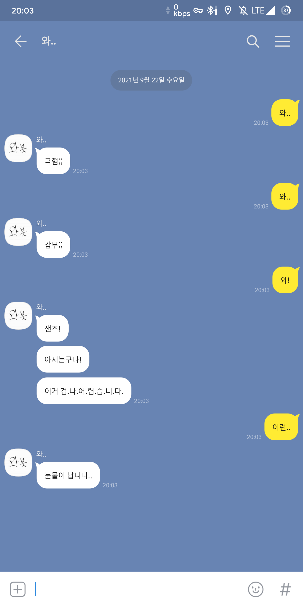

# Wa.. Chat Bot API

</img>
</img>

**와..** 하면 대답하는 ~~헛소리~~ 봇입니다.<br/>
하지만 **코로나 몇명** 등의 쓸모 있는 정보를 제공하기도 합니다.

Python Flask를 이용해 개발되었으며, 추후 ```Node.JS``` 기반으로 변경할 계획입니다.

반응하는 키워드 목록과 API 사용법은 아래 링크에서 확인하실 수 있습니다.

***

### API Usage Guide

[Engligh](Guide_EN.md)<br/>
[한국어](Guide_KO.md)

### History

* 2020\. 01\. 카카오톡 봇 단일 서비스 시작
* 2020\. 03\. 텔레그램 봇 단일 서비스 시작
* 2021\. 07\. 통합 API 서버 개발 시작
* 2021\. 08\. 카카오톡/텔레그램 봇을 API서버로 통합 및 배포 시작
* 2021\. 10\. API 서버 Node.JS 기반으로 리뉴얼 시작